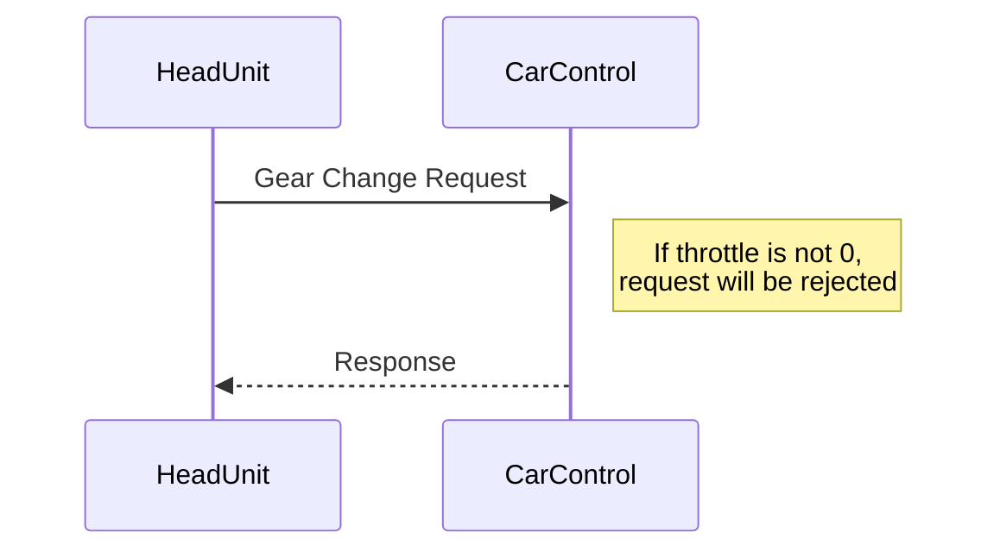
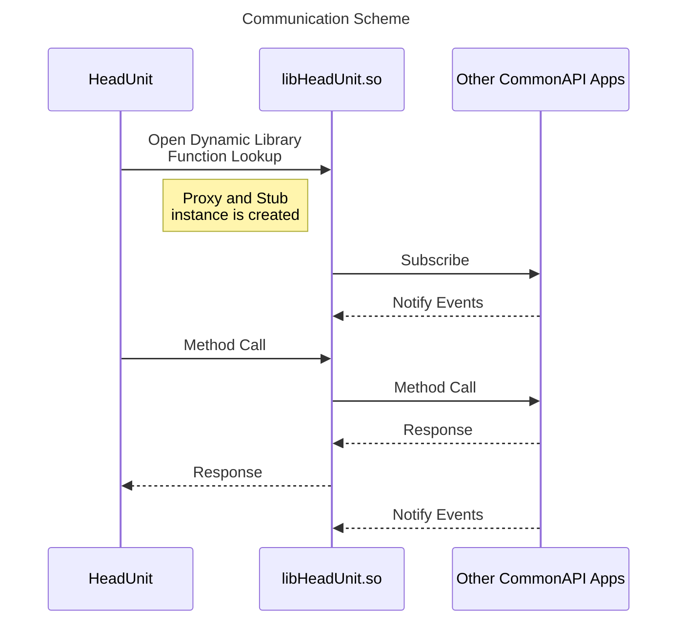

# Flutter HeadUnit
This project is part of DES_03_Head-Unit to provide infotainment feature.
Flutter was used to implement front end application.
It uses CommonAPI and SOME/IP binding as IPC

# Table of Contents
- [Features](#features)
- [Dependencies](#dendencies)
- [Gear Selection](#gear-selection)
- [Music Player](#music-player)
- [Video Player](#video-player)
- [Dark Mode](#dark-mode)
- [FFI](#ffi)
- [FIDL](#fidl)
- [References](#references)

# Features
- [Gear Selection](#gear-selection)<br/>
Head-Unit application is capable of setting gears through touch screen.

- [Music Player](#music-player)<br/>
Head-Unit application can play your favourite mp3 musics.<br/> How? Just plug in your USB!

- [Video Player](#video-player)<br/>
Head-Unit application can not only play music but also your favourite vidoes just like the music player.

- [Dark Mode](#dark-mode)<br/>
Is the screen too bright for your eyes?<br/> Don't worry! Head-Unit application support dark mode.

- USB media


# Dendencies
All these applications should be installed in your linux build host to build this project
- [vSOME/IP](https://github.com/COVESA/vsomeip) v3.4.10
- [CommonAPI Core Runtime](https://github.com/COVESA/capicxx-core-runtime) v3.2.3
- [CommonAPI SOME/IP Runtime](https://github.com/COVESA/capicxx-someip-runtime) v3.2.3
- [CarControl](https://github.com/kianwasabi/car_control)
- libmpv

# Gear Selection

Head-Unit application displays current gear on the left side of the screen. This section is always visible and accessable to the user. And also this section not only displays current gear but also is able to change gears by sending request to the controller application.




# Music Player


Music player uses [media_kit](https://pub.dev/packages/media_kit) to play media. When the music application widget is opened, the widget will try to read application's bundle directory and `/media`, `/run/media` for USB medium. Therefore to read and play media from USB, it is necessary to mount them on those directories. If the system does not mount usb or not on those directories, pleas configure yout udev rules accordingly.

Music player supports
- metadata
- progress bar
- scrollerable playback
- player control
- volume control

Metadata is fetched by using [metadata_god](https://pub.dev/packages/metadata_god) package.

Progress bar was implemented by using [Player.stream](https://pub.dev/packages/media_kit#handle-playback-events) and [rxdart](https://pub.dev/packages/rxdart).


On left bottom there is a floating action button, which will open drawer to show your current playlist.

# Video Player


Video player also uses [media_kit](https://pub.dev/packages/media_kit) to play video. Similar to the music player when the widget is opened, the widget will try to read  `/media`, `/run/media` for videos in USB.

Video player uses `MaterialVideoControls` controller type since infotainment system only uses touch screen as input device rather then mouse like desktop environment.

# Dark Mode


User can choose theme between light mode or dark mode. [ChangeNotifier](https://api.flutter.dev/flutter/foundation/ChangeNotifier-class.html) was used to implement this feature, since cupertino widgets don't share same attributes in material app, it was necessary to override some attributes manually.

# FFI
Foreign function interface(FFI) is necessary to use CommonAPI since flutter does not support it directly like dbus. CommonAPI-someip is used to communicate with other applications like CarControl and Dashboard applications. To build proxy and stub for CommonAPI, custom plugin is generated in the flutter build process. Source codes and CMakeLists.txt for this plugin is located in `lib/ffi` directory.



# FIDL
```
package commonapi

interface HeadUnit {
    version { major 0 minor 1 }

    attribute Boolean lightMode readonly
    attribute MetaData metadata readonly

    struct MetaData {
        UInt8[] albumcover
        String artist
        String title
    }
}
```
libHeadUnit-someip.so provides proxy for other applications. In `HeadUnit.fidl` file, attributes are defined as shown on top. [Flutter_Dashboard](https://github.com/Lagavulin9/Flutter_Dashboard) subscribes to these attributes to update it's widgets.

> On Dashboard

Widgets are updated on other applications also!

# References
- [DES_Head-Unit](https://github.com/SEA-ME/DES_Head-Unit)
- [vsomeip in 10 minutes](https://github.com/COVESA/vsomeip/wiki/vsomeip-in-10-minutes)
- [CommonAPI wiki](https://github.com/COVESA/capicxx-core-tools/wiki)
- [Flutter FFI](https://docs.flutter.dev/platform-integration/android/c-interop)
